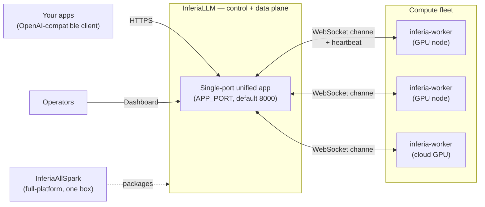
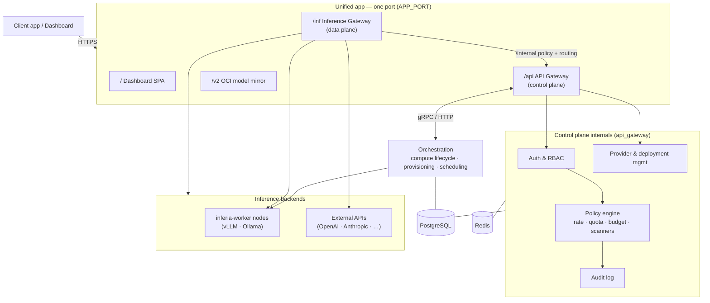
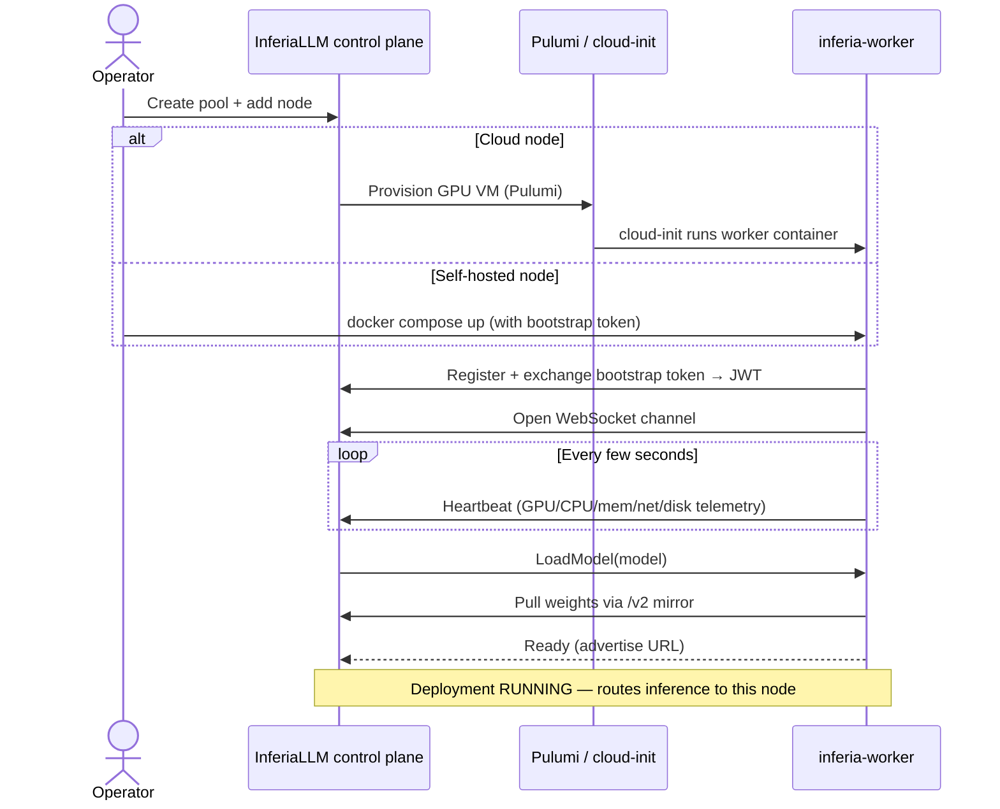
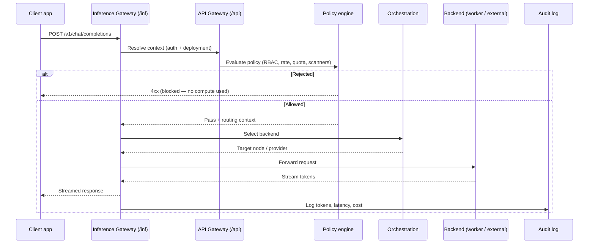
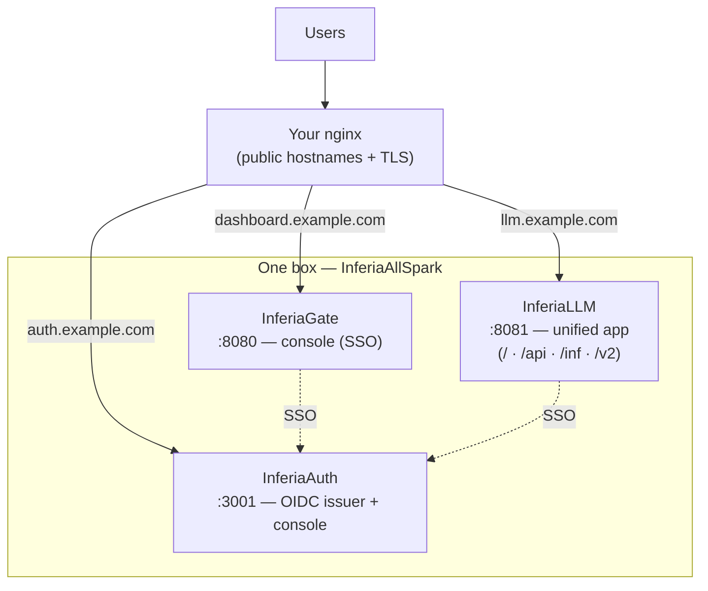

<div align="center">

<picture>
  <source media="(prefers-color-scheme: dark)" srcset="assets/readme-banner-dark.svg">
  
</picture>

[](https://pypi.org/project/inferiallm/)
[](https://hub.docker.com/r/inferiaai/inferiallm)
[](./LICENSE)
[](https://www.python.org/)
[]()

**[Quick Start](#quick-start)** · **[Architecture](#architecture)** · **[Compute Fleet](#compute-fleet)** · **[Self-Hosting](#self-hosting-with-docker-compose)** · **[CLI](#cli)** · **[Contributing](#contributing)**

</div>

---

## What is InferiaLLM

InferiaLLM is a **self-hosted operating system for running LLMs in production**. It sits between your applications and your AI infrastructure and provides the platform primitives that organizations need but nobody wants to build from scratch:

- **Access control & RBAC** — who can use which models, and how much
- **Policy & safety** — rate limits, quotas, token budgets, and content scanners (toxicity, PII) enforced per org and per deployment
- **Inference routing** — an OpenAI-compatible gateway with failover, load balancing, and backend selection
- **Compute orchestration** — provision and manage a fleet of GPU nodes across clouds, on-prem, and decentralized networks
- **Cost controls** — per-user quotas, token budgets, and rate limiting
- **Audit logging** — every request tracked, every policy decision recorded

These are operating-system responsibilities. InferiaLLM delivers them as a single, cohesive, single-port deployment.

> **Why this exists:** LLMs, inference engines, and GPUs are all available — but they are not *operable* by an organization on their own. To run AI in production, teams end up stitching together a dozen tools. InferiaLLM consolidates that entire layer.

It is **not** a model, a runtime, or a training system. It governs how those systems are used.

---

## The Inferia platform

InferiaLLM is the brain of a three-repository platform. This repo is the control + data plane; two sibling projects complete the picture:

| Repository | Language | Role |
| :--- | :--- | :--- |
| **[InferiaLLM](https://github.com/InferiaAI/InferiaLLM)** (this repo) | Python · React | Control plane (auth, RBAC, policy, audit, orchestration) + data plane (OpenAI-compatible inference gateway) + admin dashboard. Ships as one single-port app. |
| **[inferia-worker](https://github.com/InferiaAI/inferia-worker)** | Go | GPU-node agent. Runs on every compute node (bare metal, self-hosted server, or cloud VM), connects back to the control plane, loads models on demand, and serves inference off its local GPUs. |
| **[InferiaAllSpark](https://github.com/InferiaAI/InferiaAllSpark)** | Compose | One-box deployment of the *full* Inferia platform — shared **InferiaAuth** identity, **InferiaGate**, and **InferiaLLM** behind a single reverse proxy. |



---

## Architecture

The whole surface runs as **one ASGI app on a single port** (`APP_PORT`, default `8000`). Historically there were separate ports for the gateway, inference, and dashboard; these are now collapsed in-process behind mount prefixes:

| Mount | Sub-app | Responsibility |
| :--- | :--- | :--- |
| `/api` | API Gateway | Control plane — auth, RBAC, policy, audit, provider config, orchestration proxy |
| `/inf` | Inference Gateway | Data plane — OpenAI-compatible chat/completions/embeddings |
| `/v2/*` | OCI registry mirror | Model image/weights mirror (served at root; the OCI spec hard-codes `<host>/v2`) |
| `/` | Dashboard SPA | React admin UI (static, with `index.html` fallback) |



**Data plane** (`/inf`) handles inference traffic. The Inference Gateway normalizes every request to the OpenAI schema, evaluates policy via the control plane, then routes to a backend — a worker node or an external API — and streams the response back.

**Control plane** (`/api`) authenticates and authorizes, enforces policy and budgets, records audit, and manages provider credentials and deployments. The orchestration subsystem owns the compute fleet lifecycle.

> Need separate processes per service? A **split (microservices)** mode is still supported via Docker Compose profiles — see [Services & ports](#services--ports).

---

## Compute Fleet

InferiaLLM treats compute as a first-class, governed resource. A **pool** is a logical group of GPU nodes; each node runs the **[inferia-worker](https://github.com/InferiaAI/inferia-worker)** agent. Nodes are either **self-hosted** (you run the worker on your own hardware) or **cloud-provisioned** (InferiaLLM stands up the VM for you via Pulumi and cloud-init installs the worker automatically).

Once running, a worker exchanges a short-lived bootstrap token for a long-lived JWT, opens a persistent WebSocket channel to the control plane, and heartbeats live telemetry (CPU, memory, GPU utilization & VRAM, network, disk). The control plane sends `LoadModel` commands over that channel; the worker pulls the model (through the `/v2` mirror) and begins serving OpenAI-compatible inference on its advertised URL.



### Adding a self-hosted GPU node

On the control-plane host, scaffold a ready-to-run worker deployment:

```bash
inferiallm worker compose \
  --pool-id <POOL_UUID> \
  --node-name gpu-1 \
  --advertise-url http://<worker-host>:8080 \
  --out-dir ./inferia-worker-deploy
```

This writes a `.env` (with a freshly minted bootstrap token) and a `docker-compose.yml`. Copy that directory to your GPU host (Docker + NVIDIA Container Toolkit required) and run:

```bash
cd inferia-worker-deploy && docker compose up -d
```

The node appears in the dashboard within seconds and is ready to receive model deployments. See the [inferia-worker README](https://github.com/InferiaAI/inferia-worker) for details.

### Providers

| Provider | Type | How it connects |
| :--- | :--- | :--- |
| **Self-hosted worker** | Bare metal / your VMs | inferia-worker registers directly |
| **AWS** | Cloud GPU (EC2) | Provisioned via Pulumi; cloud-init runs the worker |
| **GCP** | Cloud GPU (Compute Engine) | Provisioned via Pulumi |
| **Azure** | Cloud GPU | Provisioned via Pulumi |
| **Nosana** | Decentralized GPU (DePIN) | Native sidecar integration |
| **Akash** | Decentralized cloud | SDL-based deployment |
| **Kubernetes** | On-prem / managed clusters | Direct orchestration |

**Local inference engines:** vLLM · Ollama · TEI · Infinity · Inferia Diffusion (image/video)

**External API providers:** OpenAI · Anthropic · Cohere · Gemini · Groq · Cerebras · OpenRouter

---

## Request Lifecycle

Every request flows through a governed pipeline before it reaches a model. Requests that fail auth, policy, or safety are rejected **before** any inference — no GPU time is wasted on unauthorized or unsafe traffic.



---

## Quick Start

The fastest way to a running stack is **Docker Compose** (below). You can also install the [PyPI package](#install-from-pypi) or [build from source](#build-from-source).

### Self-Hosting with Docker Compose

The repository ships a single `docker-compose.yml` that builds and runs the whole platform (unified app + PostgreSQL + Redis + Elasticsearch/Logstash/Kibana for logs).

```bash
# 1. Clone
git clone https://github.com/InferiaAI/InferiaLLM.git && cd InferiaLLM

# 2. Configure
cp .env.example .env

# 3. Generate secrets and paste them into .env
openssl rand -hex 32                 # JWT_SECRET_KEY
openssl rand -hex 32                 # INTERNAL_API_KEY
openssl rand -hex 32                 # LOG_ENCRYPTION_KEY
python -c "from cryptography.fernet import Fernet; print(Fernet.generate_key().decode())"   # SECRET_ENCRYPTION_KEY
# Also set: POSTGRES_PASSWORD, PG_ADMIN_PASSWORD, DATABASE_URL password,
#           SUPERADMIN_EMAIL, SUPERADMIN_PASSWORD

# 4. Launch
docker compose up -d --build
```

That's it. Everything is served on one port:

> **Dashboard, API, and inference:** `http://localhost:8000` (or whatever you set `APP_PORT` to)
> — Dashboard at `/`, control plane at `/api`, inference at `/inf`, model mirror at `/v2`.

Database migrations run automatically on boot. Log in with the `SUPERADMIN_EMAIL` / `SUPERADMIN_PASSWORD` you set.

<details>
<summary><strong>Deployment variants (localhost TLS, SSO, split microservices)</strong></summary>
<br/>

```bash
# Default: unified app + Postgres + Redis + ELK
docker compose up -d --build

# Localhost TLS via Caddy (https://localhost)
docker compose -f docker/docker-compose.localhost.yml up -d --build

# SSO mode — InferiaLLM behind InferiaAuth (OIDC)
make docker-up-sso

# Split (microservices) — one container per service via profiles
docker compose -f docker/docker-compose.profiles.yml --profile split up -d --build
```

See [`docker/README.md`](./docker/README.md) for reverse-proxy contracts, TLS, and the full matrix of compose files.
</details>

### Install from PyPI

```bash
pip install inferiallm

# Configure
curl -o .env https://raw.githubusercontent.com/InferiaAI/InferiaLLM/main/.env.example
nano .env                       # set DB, Redis, and secrets

inferiallm init                 # bootstrap database, roles, schemas
inferiallm start                # start the unified app
```

Requires Python 3.10–3.12 and reachable PostgreSQL + Redis.

### Build from source

```bash
git clone https://github.com/InferiaAI/InferiaLLM.git && cd InferiaLLM

python3 -m venv .venv && source .venv/bin/activate
pip install -e .

cp .env.example .env            # edit: DB, Redis, secrets
make setup                      # install environment + dependencies (runs setup_project.sh)
inferiallm init --env dev
inferiallm start
```

---

## Services & ports

In the default **unified** mode everything is on `APP_PORT` (8000). The supporting infrastructure and the optional **split** mode expose the following:

| Component | Default port | Mode | Notes |
| :--- | :---: | :--- | :--- |
| **Unified app** | `8000` | unified | Dashboard `/`, gateway `/api`, inference `/inf`, mirror `/v2` |
| API Gateway | `8000` | split | Control plane only |
| Inference Gateway | `8001` | split | Data plane only |
| Orchestration | `8080` | both | Compute lifecycle, worker channel |
| DePIN sidecar | `3000` | optional | Decentralized compute coordination |
| PostgreSQL | `5432` | infra | Primary datastore |
| Redis | `6379` | infra | Rate limiting, pub/sub, streams |
| Kibana | `5601` | optional | Log exploration (ELK) |
| inferia-worker | `8080` | per node | Inference port advertised by each GPU node |

---

## Configuration

InferiaLLM is configured via a `.env` file (start from [`.env.example`](./.env.example)). Key variables:

### Core & web

| Variable | Description | Default |
| :--- | :--- | :--- |
| `APP_PORT` | Single port for the unified app | `8000` |
| `ENVIRONMENT` | `production` or `dev` | `production` |
| `AUTH_PROVIDER` | `local` or `inferiaauth`/`oidc` (external SSO) | `local` |
| `ALLOWED_ORIGINS` | CORS allow-list (comma-separated) | — |
| `FORWARDED_ALLOW_IPS` | Trusted proxy IPs (for correct client IPs behind nginx/Caddy) | — |

### Security

| Variable | Description |
| :--- | :--- |
| `JWT_SECRET_KEY` | Signs access tokens. Min 32 chars (`openssl rand -hex 32`). |
| `INTERNAL_API_KEY` | Authenticates service-to-service calls. Min 32 chars. |
| `SECRET_ENCRYPTION_KEY` | **Fernet** key (URL-safe base64, 32 bytes) for encrypting provider credentials. Generate with `python -c "from cryptography.fernet import Fernet; print(Fernet.generate_key().decode())"`. |
| `LOG_ENCRYPTION_KEY` | 32-byte hex key for encrypting sensitive log fields. |
| `SUPERADMIN_EMAIL` / `SUPERADMIN_PASSWORD` | Initial admin login. |

> **Fail closed:** if `INTERNAL_API_KEY` is unset, internal endpoints refuse service. Missing config is treated as an error, never a bypass.

### Datastores

| Variable | Description | Default |
| :--- | :--- | :--- |
| `DATABASE_URL` | PostgreSQL connection. **Canonical form is bare `postgresql://`** (no `+asyncpg`). | `postgresql://inferia:…@postgres:5432/inferia` |
| `REDIS_HOST` / `REDIS_PORT` | Redis connection | `redis` / `6379` |

### Compute & models

| Variable | Description | Default |
| :--- | :--- | :--- |
| `INFERIA_WORKER_IMAGE` | Worker container image repository | `ghcr.io/inferiaai/inferia-worker` |
| `INFERIA_WORKER_IMAGE_TAG` | Worker image tag deployed to provisioned nodes | `0.2.7` |
| `INFERIA_MODEL_CACHE_DIR` | Host path for the model cache / mirror | `/var/lib/inferia/models` |
| `INFERIA_MODEL_MIRROR_BASE` | Public base URL of this control plane (for the `/v2` + `/hf` mirror) | — |
| `INFERIA_SSH_AUTHORIZED_KEYS_FILE` | Public keys baked into provisioned cloud workers | `./.ssh/authorized_keys` |

---

## CLI

```bash
inferiallm init                        # Bootstrap database, roles, schemas
inferiallm migrate                     # Apply pending migrations (auto-runs in Docker)
inferiallm start                       # Start the unified app (all services)
inferiallm start api-gateway           # Split mode: control plane only
inferiallm start inference             # Split mode: data plane only
inferiallm start orchestration         # Split mode: orchestration only

# Provider credentials (DB-backed, encrypted)
inferiallm providers list
inferiallm providers add aws  --name prod --type access_key_id --value AKIA...
inferiallm providers remove aws --name prod

# Compute nodes
inferiallm node add worker --name gpu-1 --pool-id <id> --advertise-url http://host:8080
inferiallm worker compose --pool-id <id> --node-name gpu-1 --advertise-url http://host:8080
inferiallm worker token   --pool-id <id> --ttl-hours 1
inferiallm worker list    --pool-id <id>
```

---

## Tech Stack

| Layer | Technology |
| :--- | :--- |
| **Language** | Python 3.10–3.12 · Go (worker) |
| **API** | FastAPI (async), single-port ASGI mounts |
| **Frontend** | React 19 · Vite · TailwindCSS · Shadcn/UI · TanStack Query |
| **Inter-service** | gRPC + Protobuf · Redis Streams/Pub-Sub · WebSocket worker channel |
| **Database** | PostgreSQL 15 (async SQLAlchemy / asyncpg) |
| **Cache / broker** | Redis 7 |
| **Auth** | Stateless JWT; optional external SSO (InferiaAuth / OIDC) |
| **Encryption** | Fernet symmetric encryption for credentials at rest |
| **Provisioning** | Pulumi (AWS/GCP/Azure) + cloud-init |
| **Observability** | Prometheus-compatible metrics; optional ELK (Elasticsearch/Logstash/Kibana) |
| **Vector** | pgvector / ChromaDB compatible |

---

## Deploying the full platform — InferiaAllSpark

To run the **entire Inferia platform on a single box** — one shared **InferiaAuth** identity authority consumed by **InferiaGate** and **InferiaLLM**, all behind your own reverse proxy — use **[InferiaAllSpark](https://github.com/InferiaAI/InferiaAllSpark)**.



```bash
git clone https://github.com/InferiaAI/InferiaAllSpark.git && cd InferiaAllSpark
./up.sh                # bring everything up + smoke-check
./up.sh --build        # force-rebuild all images first
./down.sh -v           # stop and wipe data volumes
```

The LLM host needs WebSocket upgrade, response buffering off, large request bodies, and long timeouts (for SSE token streaming and multi-GB model pulls over `/api/hf` and `/v2`). See [`docker/README.md`](./docker/README.md) and the InferiaAllSpark nginx contract.

---

## Repository layout

```
InferiaLLM/
├─ src/
│  ├─ unified_web/      # Single-port parent app (mounts /api, /inf, /v2, /)
│  ├─ api_gateway/      # Control plane: auth, rbac, policy, audit, gateway, management
│  ├─ inference/        # Data plane: OpenAI-compatible engines + provider adapters
│  ├─ orchestration/    # Compute lifecycle, node/pool API, worker channel, depin-sidecar
│  ├─ providers/        # Compute provider adapters (aws, gcp, azure, nosana, akash, k8s, worker, pulumi)
│  ├─ cli/              # `inferiallm` command-line entry point
│  ├─ common/           # Shared logging, errors, utilities
│  ├─ infra/            # SQL schemas + migrations
│  └─ dashboard/        # Built React SPA (source in apps/dashboard)
├─ apps/dashboard/      # Dashboard source (React 19 + Vite)
├─ docker/              # Dockerfile, compose profiles, Caddy/nginx, logstash
├─ docker-compose.yml   # Default unified deployment (project name: deploy)
└─ .env.example         # Configuration template
```

---

## Contributing

Contributions are welcome. Each major component carries its own README with architecture context:

| Component | Responsibility | Documentation |
| :--- | :--- | :--- |
| **API Gateway** | Control plane: auth, policy, audit | [README](./src/api_gateway/README.md) |
| **Inference** | OpenAI-compatible data plane | [README](./src/inference/README.md) |
| **Orchestration** | Compute lifecycle & worker fleet | [README](./src/orchestration/README.md) |
| **RBAC** | Identity and access boundaries | [README](./src/api_gateway/rbac/README.md) |
| **Gateway** | Secure internal service routing | [README](./src/api_gateway/gateway/README.md) |
| **Policy** | Quota, rate, and budget enforcement | [README](./src/api_gateway/policy/README.md) |
| **Audit** | Immutable execution and policy logs | [README](./src/api_gateway/audit/README.md) |
| **Deployment** | Docker, compose profiles, reverse-proxy | [docker/README](./docker/README.md) |

Open an [issue](https://github.com/InferiaAI/InferiaLLM/issues) to report bugs or request features. See [CONTRIBUTING.md](./CONTRIBUTING.md) for the development workflow.

---

<div align="center">

**Own your intelligence.**

[inferia.ai](https://inferia.ai) · [X (Twitter)](https://x.com/inferiaai) · [LinkedIn](https://www.linkedin.com/company/inferiaai)

InferiaLLM — Copyright © 2026 Inferia AI · Licensed under the Apache License, Version 2.0

</div>
