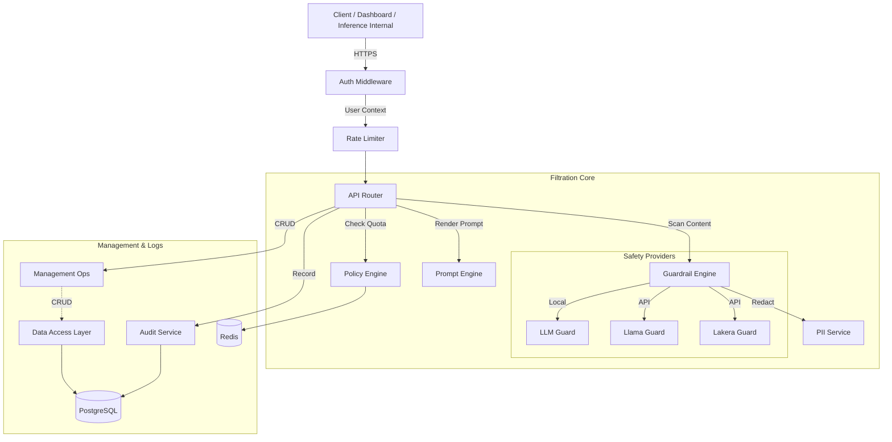

# Filtration Gateway Service

> [!IMPORTANT]
> **Code Moved**: The core logic for this service has been consolidated into the python package at `package/src/inferia/gateways/filtration_gateway`. This directory contains only the entry point shell.

The **Filtration Gateway** is the central backend service for InferiaLLM. It handles:

1. **Management APIs**: Used by the Dashboard to configure deployments.
2. **Guardrail Execution**: Running safety checks (LLM Guard, etc.).
3. **Authentication**: RBAC for the dashboard and API validation.

## Architecture

It is a **FastAPI** application that serves as both the Control Plane and the Safety Engine.

- **Entry Point**: `app.py`
- **Port**: `8000` (Default)

### Request Flow



## Setup

1. **Install Dependencies**

   ```bash
   pip install -r requirements.txt
   ```

2. **Configuration**
   Copy `.env.example` to `.env` in `services/filtration/` (or locally if running standalone, though config points to service dir).

   **Key Variables**:
   - `GUARDRAIL_GROQ_API_KEY`: For Llama Guard.
   - `GUARDRAIL_LAKERA_API_KEY`: For Lakera Guard.
   - `INTERNAL_API_KEY`: For securing internal routes.

3. **Run Service**

   ```bash
   python app.py
   ```

## Dependencies

- **`services/filtration`**: All core logic resides here. This app is primarily a wrapper to expose that logic via HTTP.
- **Database**: Connects to PostgreSQL (via `services/filtration/db`).
- **Vector DB**: Connects to ChromaDB (for RAG management).

## Inter-Service Communication

- **Inbound**: Receives requests from **Inference Gateway** on `/internal/*` ports.
- **Outbound**: Calls external APIs (Groq, Lakera, OpenAI) for safety checks and mock orchestration.
