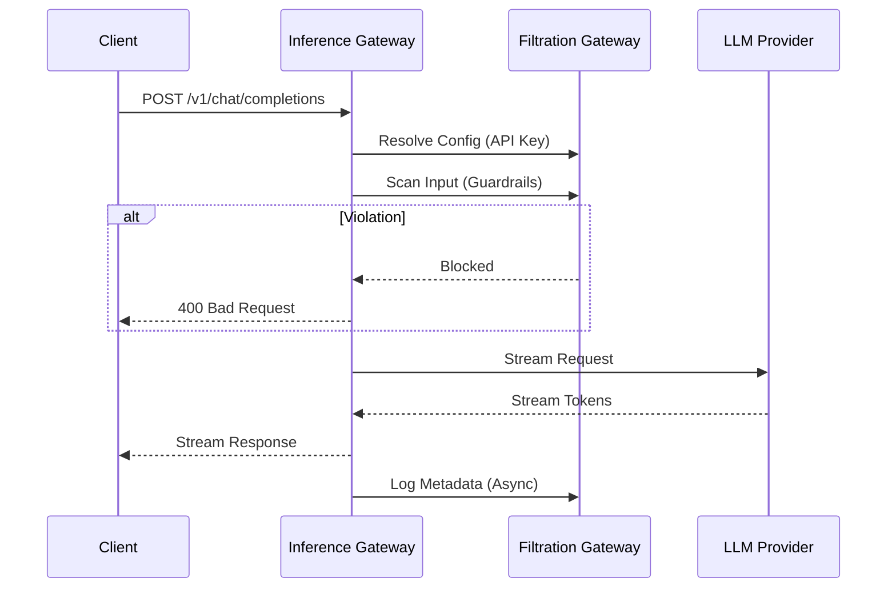

# Inference Gateway Service

> [!IMPORTANT]
> **Code Moved**: The core logic for this service has been consolidated into the python package at `package/src/inferia/gateways/inference_gateway`. This directory contains only the entry point shell.

The **Inference Gateway** is the high-performance proxy that sits between the user's application and the LLMs. It handles the "Hot Path" of inference requests.

## Responsibilities

1. **Context Resolution**: identifying which deployment handles the request.
2. **Safety Scanning**: Calling the Filtration layer to scan inputs/outputs.
3. **Prompt Engineering**: Applying templates and RAG (retrieval augmentation).
4. **Orchestration**: Routing requests to the correct upstream provider (via Orchestration Gateway resolution).
5. **Logging**: Streaming logs back to the Filtration layer for observability.

## Architecture

- **Entry Point**: `app.py`
- **Port**: `8001` (Default)
- **Core Logic**: `core/service.py`

### Inference Pipeline



## Request Flow

1. **Client Request** (`POST /v1/chat/completions`)
2. **Resolution**: Calls Filtration Gateway (`/internal/context/resolve`) to get config.
3. **Input Guardrails**: Calls Filtration Gateway (`/internal/guardrails/scan`).
    - *Blocks request if violation found.*
4. **Prompt Processing**: Applies RAG/Templates (if enabled).
5. **Upstream Call**: Streams request to actual LLM.
6. **Output Guardrails**: Scans generated text (async or blocking).
7. **Logging**: Reports metrics to Filtration (`/internal/logs/create`).

## Setup

1. **Install Dependencies**

    ```bash
    pip install -r requirements.txt
    ```

2. **Environment**
    Ensure `FILTRATION_BASE_URL` points to the Filtration Gateway (default: `http://localhost:8000`).

3. **Run Service**

    ```bash
    uvicorn app:app --port 8001
    ```

## Configuration

Requires linkage to Filtration Gateway via `INTERNAL_API_KEY` (must match Filtration's key).
