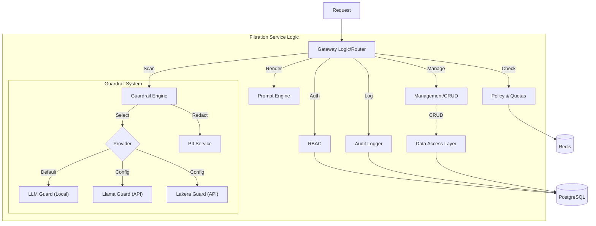

# Filtration Service

The **Filtration Service** (`services/filtration`) contains the core business logic for security, authentication, and policy enforcement in InferiaLLM. It is designed as a modular library that the `apps/filtration-gateway` application wraps.

## Architecture

The service is composed of several independent components that work together to secure the LLM lifecycle.



## Component Modules

| Module | Description | Documentation |
| :--- | :--- | :--- |
| **`guardrail/`** | The core safety engine. Manages Providers (LLM/Llama/Lakera) and PII redaction. | [README](./guardrail/README.md) |
| **`rbac/`** | Role-Based Access Control. Handles JWT validation, user context, and permissions. | [README](./rbac/README.md) |
| **`gateway/`** | Service-level routing logic, internal API security, and rate limiting buckets. | [README](./gateway/README.md) |
| **`audit/`** | Centralized structured logging for security events and inference usage. | [README](./audit/README.md) |
| **`policy/`** | logic for enforcing usage quotas and injecting context based on policy. | [README](./policy/README.md) |
| **`prompt/`** | Template engine for rendering prompts with dynamic variables. | [README](./prompt/README.md) |

## Configuration

The service uses a centralized `config.py` in each module, typically loading from the shared `.env` file.

**Key Environment Variables:**

- **Authentication**: `JWT_SECRET_KEY`
- **Guardrails**: `GUARDRAIL_GROQ_API_KEY`, `GUARDRAIL_LAKERA_API_KEY`
- **Database**: `DATABASE_URL`

## Development

To run tests for the filtration logic:

```bash
# from root
pytest services/filtration/tests/
```
