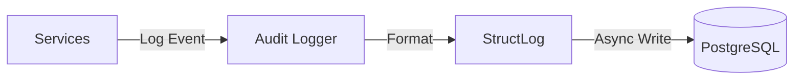

# Audit Component

The Audit component handles the centralized logging of system events, security violations, and inference metadata.

## Architecture

It provides a unified interface for recording structured logs.

### Key Modules

- **`logger.py`**: Configures usage of `structlog` or standard python `logging`.
  - Formats logs as JSON for production.
- **`models.py`**: Defines audit schemas (e.g., `InferenceLog`, `SecurityLog`).

## Integration

- **Filtration Gateway**: Logs failed authentication, blocked requests (Guardrails).
- **Inference Gateway**: Logs prompt/completion tokens, latency, and model usage.
  - Sends logs to Filtration via `/internal/logs/create`.

## Data Storage

Logs are persisted to the PostgreSQL database (`service_logs` table) for analysis in the dashboard.
