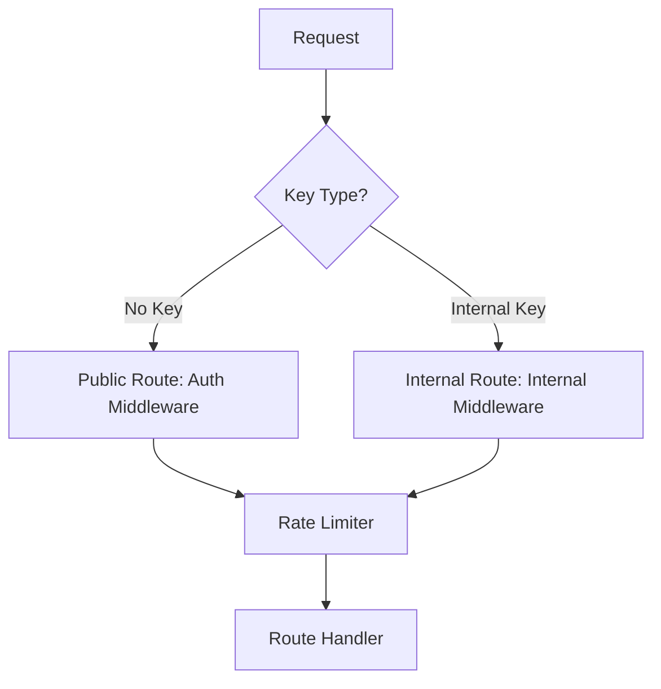

# Gateway Component

The Gateway module is the routing engine of the Filtration service. It manages request lifecycle, routing to internal services (like Guardrails), and implementing cross-cutting concerns like rate limiting.

## Architecture

The Gateway acts as a reverse proxy and orchestration layer.

### Key Modules



- **`router.py`**: Defines the main API routes (`/api/v1/scan`, `/internal/*`).
  - **Public Routes**: accessible by external clients (with Auth).
  - **Internal Routes**: accessible only by other services (like Inference Gateway) via `X-Internal-API-Key`.
- **`internal_middleware.py`**: Protects `/internal` routes.
  - Validates `X-Internal-API-Key` header.
  - Ensures service-to-service security.
- **`rate_limiter.py`**: Implements token bucket rate limiting.
  - Limits requests based on User ID or IP.
  - Configurable via `RATE_LIMIT_REQUESTS_PER_MINUTE`.

## Routing Logic

### Guardrail Scan (`/internal/guardrails/scan`)

Used by the Inference Gateway to check prompts/responses.

1. Receives text + config.
2. Invokes `GuardrailEngine`.
3. Returns `GuardrailResult`.

### Context Resolution (`/internal/context/resolve`)

Used to resolve API keys to Deployment Configurations.

1. Receives end-user API key.
2. Looks up active Deployment.
3. Returns configuration (Model, Guardrail settings, RAG settings).

## Usage

Internal endpoints require the Internal API Key:

```bash
curl -X POST http://localhost:8000/internal/guardrails/scan \
  -H "X-Internal-API-Key: <INTERNAL_KEY>" \
  ...
```
