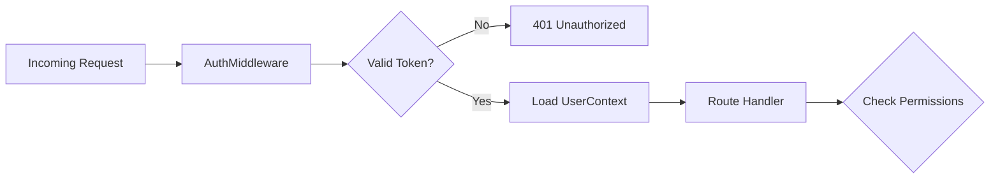

# RBAC Component (Role-Based Access Control)

The RBAC component handles Authentication (AuthN) and Authorization (AuthZ) for the Filtration Gateway.

## Architecture



### Key Modules

- **`middleware.py`**: `auth_middleware` intercepts requests to validate JWT tokens.
  - Extracts `Authorization: Bearer <token>`.
  - Decoding happens via `auth_service`.
  - Populates `request.state.user` with `UserContext`.
- **`models.py`**: Defines the `UserContext` and `PermissionEnum`.
  - `UserContext`: Contains user ID, roles, organization ID, and permissions list.
- **`auth.py`**: Handles token validation logic. In production, this would integrate with an IdP (Keycloak, Auth0). Currently uses `jose` for local JWT handling.

## Authentication Flow

1. Client sends `POST /auth/login` to obtain a JWT.
2. Client includes `Authorization: Bearer <token>` in subsequent requests.
3. `AuthMiddleware`:
    - Checks for header.
    - Validates signature using `JWT_SECRET_KEY`.
    - Checks expiration.
    - Loads user metadata.

## Authorization

Authorization is primarily **Role-Based** but flattened into **Permissions** for the application layer.

- **Roles**: Admin, Developer, Standard User, Guest.
- **Permissions**: Granular capabilities (e.g., `model:read`, `model:write`, `admin:config`).

### Protecting Endpoints

Use `require_role` or check `request.state.user.permissions` in endpoints.

```python
@router.post("/protected", dependencies=[Depends(require_role(["admin"]))])
async def protected_route():
    ...
```

## Configuration

| Variable | Description |
|----------|-------------|
| `JWT_SECRET_KEY` | Secret used to sign/verify tokens |
| `JWT_ALGORITHM` | Algorithm (HS256) |
