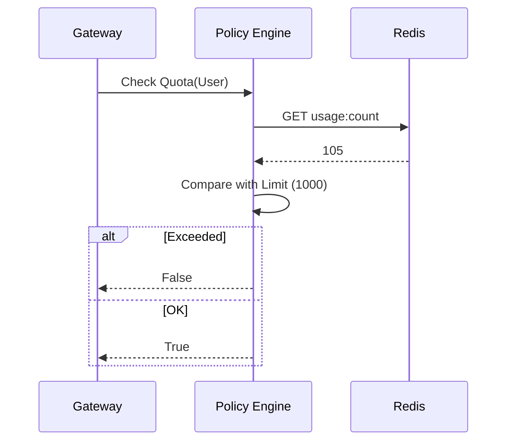

# Policy Component

The Policy component enforces usage quotas and complex access rules beyond simple RBAC.

## Features

- **Quotas**: Tracks usage (token count, request count) against limits.
- **Context Injection**: Determines system messages or additional context based on policy.

## Key Modules

- **`quotas.py`**: Logic for checking if a user/deployment has exceeded limits.
  - Connects to Redis for real-time counters.
- **`context.py`**: Logic for resolving `UserContext` to specific policy sets.

## Integration

- **Gateway**: Checks quota before processing inference requests (`/internal/policy/check_quota`).
