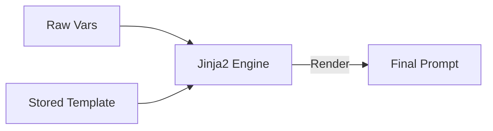

# Prompt Component

The Prompt component manages prompt templates and dynamic variable injection.

## Features

- **Templating**: Uses Jinja2 for rendering complex prompts.
- **Management**: CRUD operations for templates stored in the database.
- **Variables**: Dynamic injection of context (e.g., retrieval results, user data).

## Key Modules



- **`service.py`**: Renders templates with provided variables.
- **`models.py`**: Defines `PromptTemplate` and versioning.

## Usage

**Inference Gateway** uses this component to transform raw user input into a structured prompt before sending it to the LLM.

```python
rendered_prompt = prompt_service.render(
    template_id="customer-support-v1",
    variables={"user_query": "Help me!"}
)
```
