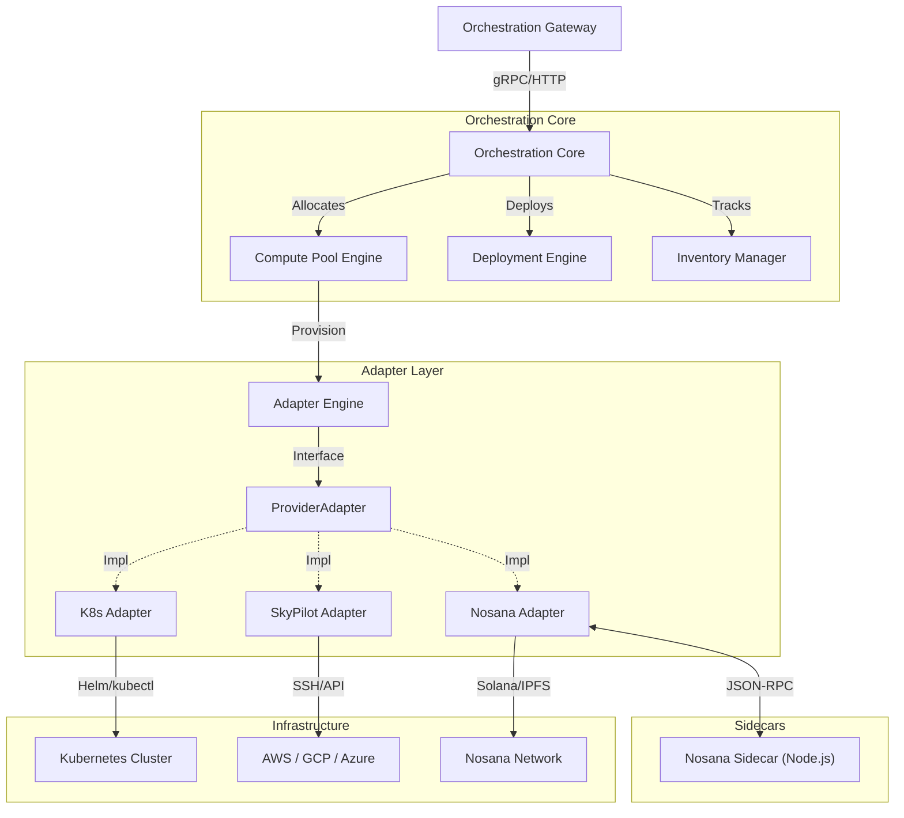

# Orchestration Service (Core)

The **Orchestration Service** is the central brain of InferiaLLM, responsible for managing the lifecycle of valid compute resources and LLM deployments. It sits between the user-facing gateways and the raw infrastructure providers (DePIN networks, Cloud providers, and On-Premises clusters).

## High-Level Architecture

The service interacts with providers via an **Adapter Pattern**, allowing seamless integration of diverse compute sources into a unified "Compute Pool" abstraction.



## Core Components

### 1. Adapter Engine (`services/adapter_engine`)

This is the infrastructure abstraction layer. It defines a strict contract (`ProviderAdapter`) that all providers must implement.

- **Goal**: To make the upper layers agnostic to *where* the compute comes from.
- **Key Methods**:
  - `discover_resources()`: Returns list of available GPU types.
  - `provision_node()`: Deploys a new compute instance with base image.
  - `deprovision_node()`: Terminates an instance.

### 2. Compute Pool Engine (`services/compute_pool_engine`)

Manages logical groupings of nodes called **Compute Pools**.

- **Pools**: A pool is a collection of nodes from a specific provider (e.g., "Nosana H100 Pool" or "AWS A10G Spot Pool").
- **Scaling**: Handles auto-scaling logic (coming soon) and manual scaling events.
- **State Management**: Tracks the `provisioning`, `ready`, and `terminated` states of nodes.

### 3. Model Deployment Engine (`services/model_deployment`)

Manages the application layer (the LLMs running on the nodes).

- **Deployments**: A deployment maps a **Model** (from Model Registry) to a **Compute Pool**.
- **Worker**: A background worker (`worker_main.py`) processes deployment tasks asynchronously to avoid blocking API requests.
- **Containerization**: Uses standardized container images (vLLM, Ollama) to ensure consistent runtime environments.

### 4. Inventory Manager (`services/inventory_manager`)

The source of truth for all active resources.

- **Heartbeats**: Nodes send periodic heartbeats to `/inventory/heartbeat`.
- **Health Checks**: Marks nodes as `unhealthy` if heartbeats are missed.
- **Routing**: Provides the routing table for the **Inference Gateway** to find active model endpoints.

## DePIN Integration (Deep Dive)

The DePIN integration requires a specialized **Sidecar** because it interacts with the Solana blockchain and IPFS, which is handled more robustly in the Node.js ecosystem (`@nosana/sdk`).

### Flow

1. **Orchestrator** calls `NosanaAdapter.provision_node()`.
2. **NosanaAdapter** formats a Job Definition (JSON) describing the container (vLLM).
3.** sends a request **NosanaAdapter to the **DePIN Sidecar** (`localhost:3000/jobs/launch`).
4. **Sidecar** uploads definition to IPFS and posts a transaction to Solana.
5. **Sidecar** watches the job on-chain for events (Posted -> Claimed -> Running).
6. **Sidecar** sends heartbeats to **Orchestrator** with the job's exposed IP/URL.
7. **Sidecar** handles auto-extensions (extending job timeout) and auto-redeployment on failure.

**Sidecar Location**: `services/depin-sidecar/`

## Adapters

Supported providers:

| Provider | Type | Description |
|----------|------|-------------|
| **Kubernetes** | On-Prem | Uses `kubernetes` python client to spawn Pods/Services. |
| **SkyPilot** | Cloud | Uses `skypilot` to provision VMs on AWS, GCP, Azure, Lambda, etc. |
| **Nosana** | DePIN | Uses decentralized GPU grid via Nosana Network. |

### Adding a New Provider

1. Create `services/adapter_engine/adapters/<provider_name>/`.
2. Implement `ProviderAdapter` class.
3. Register in `services/adapter_engine/registry.py`.

## Data Model

Key database tables (PostgreSQL):

- **`compute_pools`**: Configuration for a resource pool (Provider, Region, Quotas).
- **`inventory_nodes`**: Individual instances (VMs, Pods, Jobs). Includes `ip_address`, `status`, `resources`.
- **`model_deployments`**: Active LLM services. Links `model_id` to `pool_id`.
- **`model_registry`**: Catalog of supported models (Llama 3, Mistral, etc.) and their docker images.

## Configuration

The service is configured via environment variables (passed through `apps/orchestration-gateway/.env`).

| Variable | Description |
|----------|-------------|
| `POSTGRES_DSN` | Database connection string. |
| `REDIS_HOST` | Redis for event bus and caching. |
| `NOSANA_SIDECAR_URL` | URL of the local sidecar (default `http://localhost:3000`). |
| `NOSANA_INTERNAL_API_KEY` | Secret key for securing generated Nosana deployments. |

## Development

The code is organized as a modular monolith. The entry point is in `apps/orchestration-gateway`, but the logic lives here.

**To run tests:**

```bash
pytest services/orchestration/test/
```
